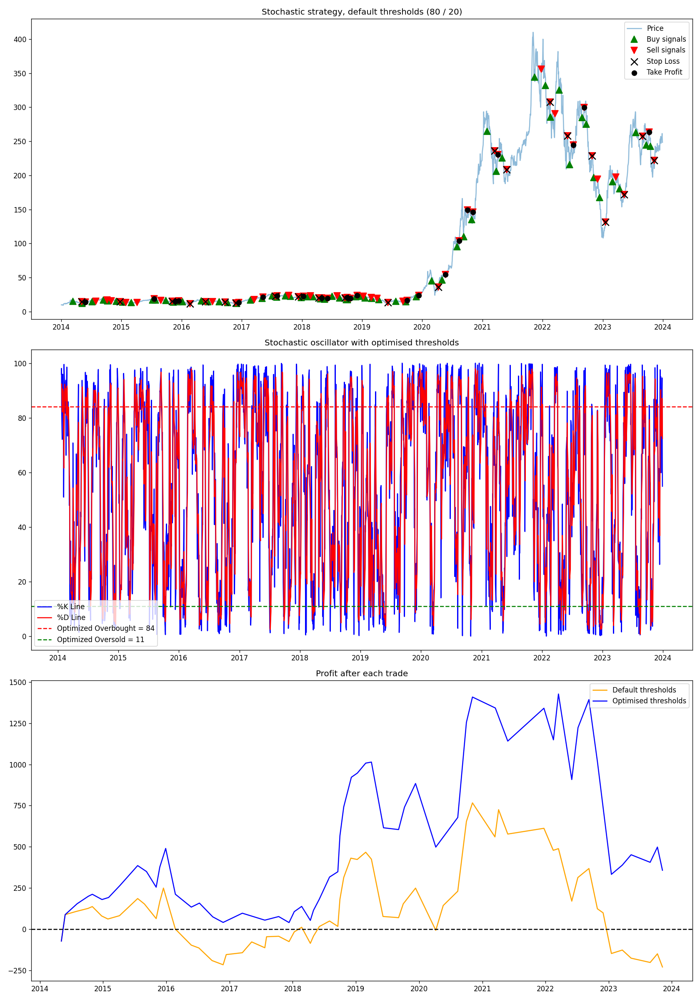

# Stochastic oscillator trading strategy backtest

A course project (Fundamentals of Investing, Vilnius University) that builds a simple trading
strategy on the stochastic oscillator, backtests it on ten years of daily TSLA prices and checks
whether tuning the thresholds improves the risk-adjusted result.

## How it works

1. **Indicator.** %K measures where today's close sits within the high–low range of the last 14
   days; %D is its 3-day moving average.
2. **Signals.** Long-only: buy when %K falls to the oversold level (default 20), sell when it rises
   to the overbought level (default 80). One position at a time.
3. **Backtest.** All-in/all-out with 1 % commission per exit. Each closed trade is classified as a
   stop-loss (−2 %), take-profit (+5 %) or ordinary exit, and profit after each trade is recorded.
4. **Optimisation.** A grid search over overbought ∈ [70, 90] and oversold ∈ [10, 30] picks the pair
   with the highest Sharpe ratio (mean / standard deviation of per-trade profit, risk-free rate 0).

The script prints the profit and Sharpe ratio for the default and optimised thresholds and saves a
three-panel chart: price with buy/sell markers, the oscillator with the optimised levels, and profit
after each trade for both variants.

## Result




## Running it

```
pip install -r requirements.txt
python stochastic_oscillator_backtest.py
```

Change `ticker` and the date range at the bottom of the script to test another stock.

## Caveats

This is a learning exercise, not a trading recommendation. The thresholds are optimised on the same
data they are evaluated on, so the "optimised" result is in-sample and will overstate real
performance. There is no walk-forward validation, no slippage and no risk-free rate in the Sharpe
ratio.

The buy-and-hold comparison above shows the main limitation of mean-reversion signals on a
strongly trending stock.
